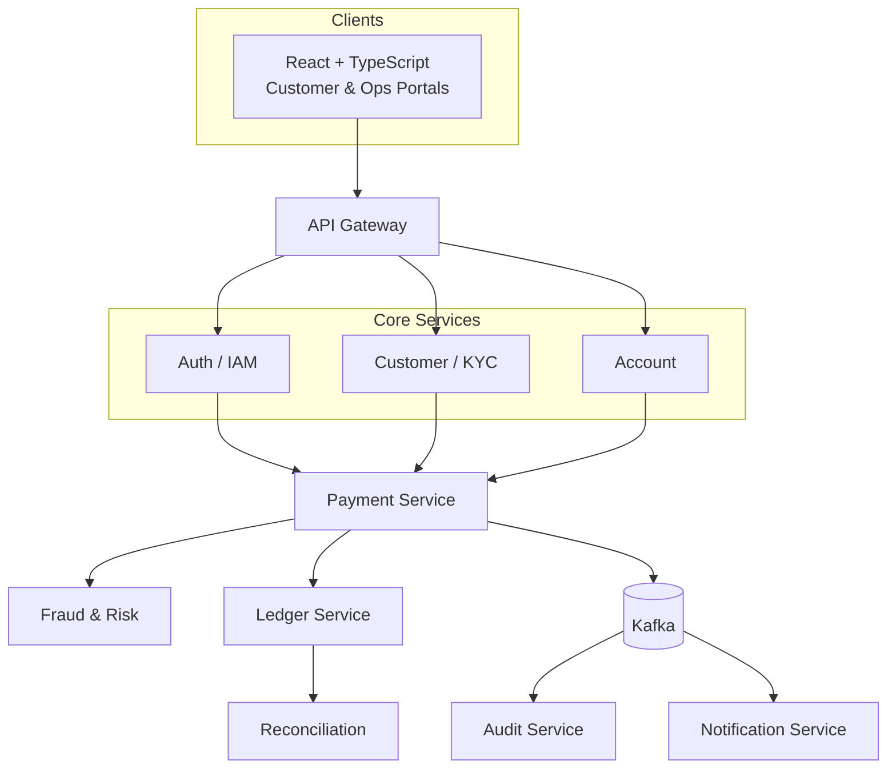

# Meridian Bank

**Meridian Digital Banking & Payments Platform**

> Secure Banking. Trusted by Design.

Meridian Bank is a **fictional, portfolio-quality digital bank** built to demonstrate enterprise-grade
backend and frontend engineering practice for online payments and banking systems: microservices,
event-driven architecture, a double-entry ledger, idempotent payments, fraud/AML controls,
maker-checker governance, audit, reconciliation, and observability.

> ⚠️ **This is a demo/educational project.** Meridian Bank is not a real bank. It never uses real
> customer, banking, payment, KYC, or identity data, and it makes no claim of regulatory
> certification or production banking compliance. See [Safety & Realism Rules](#safety--realism-rules).

---

## Product Names

| Surface | Name |
|---|---|
| Product | Meridian Digital Banking & Payments Platform |
| Customer-facing portal | Meridian Digital Banking |
| Internal portal | Meridian Operations & Compliance |

---

## What This Project Demonstrates

- **Java 21 / Spring Boot 3.x** microservices with Spring Security, Spring Data JPA/Hibernate
- **PostgreSQL** with Flyway migrations, proper transactional boundaries, and concurrency control
- **Apache Kafka** event-driven workflows with the transactional outbox pattern, retries, and DLQs
- **Redis** for idempotency lookups, rate limiting, and short-lived risk/OTP data
- **Double-entry ledger** for all money movement — never a bare balance mutation
- **Idempotent payment APIs** safe to retry under Resilience4j-backed resilience policies
- **Fraud, AML, and maker-checker (four-eyes)** controls on sensitive banking operations
- **RBAC** across customer, operations, compliance, risk, audit, and admin roles
- **Full audit trail** and data governance (classification, masking, retention)
- **React + TypeScript** customer and operations portals with a professional banking UI
- **Observability** via Actuator, Micrometer, Prometheus, and Grafana
- **Testing** with JUnit 5, Mockito, and Testcontainers, including concurrency and security tests
- **Docker, Kubernetes, and CI/CD** so the whole platform runs locally without paid cloud services

---

## Repository Structure

```text
meridian-bank/
│
├── frontend/                     # React + TypeScript customer & operations portals
│
├── services/
│   ├── api-gateway/               # Edge routing, auth propagation, rate limiting
│   ├── auth-service/              # IAM: login, JWT, MFA, RBAC
│   ├── customer-kyc-service/      # Customer profile, onboarding, KYC review
│   ├── account-service/           # Account opening, balances, statements
│   ├── payment-service/           # Payment orchestration, idempotency
│   ├── ledger-service/            # Double-entry ledger, balance derivation
│   ├── fraud-risk-service/        # Fraud rules, risk scoring, AML monitoring
│   ├── notification-service/      # In-app / email / SMS (simulated) notifications
│   └── audit-service/             # Append-only audit trail
│
├── infrastructure/
│   ├── docker/                    # Service Dockerfiles support assets
│   ├── kafka/                     # Topic definitions, broker config
│   ├── postgres/                  # DB bootstrap config
│   ├── redis/                     # Redis config
│   ├── prometheus/                # Scrape configs
│   ├── grafana/                   # Dashboards & provisioning
│   └── kubernetes/                # Deployments, services, configmaps, secrets
│
├── docs/
│   ├── architecture/              # System, component & sequence diagrams
│   ├── api/                       # API governance & conventions
│   ├── security/                  # Security architecture
│   ├── governance/                # Data governance & classification
│   ├── database/                  # Domain model / ERD
│   ├── kafka/                     # Topic catalog & event contracts
│   ├── reconciliation/            # Reconciliation design
│   └── adr/                       # Architecture Decision Records
│
├── scripts/                       # Local dev / demo data / utility scripts
│
├── docker-compose.yml              # Local infra + services (populated in Phase 1+)
├── README.md
├── CLAUDE.md
└── .gitignore
```

---

## Architecture at a Glance



Full diagrams (component, sequence flows) live in [docs/architecture](docs/architecture).

---

## Technology Stack

**Backend:** Java 21, Spring Boot 3.x, Spring Security, Spring Data JPA, Hibernate, Bean Validation,
Maven, Flyway, PostgreSQL, Apache Kafka, Redis, Resilience4j, Micrometer, Spring Boot Actuator,
OpenAPI/Swagger, Lombok, MapStruct.

**Frontend:** React, TypeScript, Vite, React Router, TanStack Query, Axios, React Hook Form, Zod,
Material UI, Recharts.

**Testing:** JUnit 5, Mockito, Spring Boot Test, Testcontainers.

**Infrastructure:** Docker, Docker Compose, Kubernetes (Minikube/Kind), GitHub Actions, Prometheus,
Grafana.

---

## Development Approach

This project is built **incrementally, in phases** — see [CLAUDE.md](CLAUDE.md) for the full phase
plan and the working rules that govern how each phase is implemented. Each phase is compiled, tested,
and documented before moving to the next; business functionality is never scaffolded ahead of the
phase that owns it.

**Current status: Phase 18 — Docker + Kubernetes.** The full chain — registration → KYC verification
→ account opening → beneficiary add/verify → a real account-to-account payment that genuinely
moves money via a real double-entry ledger, idempotent and concurrency-safe by design — works
end-to-end across `auth-service`, `customer-kyc-service`, `account-service`, `payment-service`, and
`ledger-service`. As of Phase 8, `customer-kyc-service`, `account-service`, and `payment-service`
also genuinely publish real domain events (`customer.created`, `kyc.updated`, `account.created`,
`account.approved`, `payment.initiated`, `payment.completed`, `payment.failed`) to a real Kafka
broker via the transactional outbox pattern, with producer-side retry and a dead-letter topic on
exhausted attempts — verified against a real broker, not simulated; see
[docs/architecture/kafka-architecture.md](docs/architecture/kafka-architecture.md). As of Phase 9,
every payment is genuinely risk-scored by a real `fraud-risk-service` — configurable weighted
fraud rules (amount, velocity, new-beneficiary, repeat-risk, rapid-sequential) decide
`ALLOW`/`REVIEW`/`BLOCK`, which `payment-service` enforces, while independent AML signals
(high-value, velocity, structuring, repeated-beneficiary) raise a separate compliance queue; both
publish real `fraud.detected` events, and a `RISK_ANALYST`/`COMPLIANCE_OFFICER` reviews and
resolves alerts over real RBAC-gated endpoints (no Kafka consumer existed yet at this point in the
project — see the Phase 11 paragraph below for `audit-service`, this project's first one) — see
[services/fraud-risk-service/README.md](services/fraud-risk-service/README.md) for exactly what's
real and what's still a documented placeholder. As of Phase 10, five sensitive operations are
genuinely gated behind two-person maker-checker approval, enforced server-side (not just hidden in
a UI): account blocking (`account-service`), customer status changes (`customer-kyc-service`),
fraud alert resolution and fraud rule updates (`fraud-risk-service`), and release of a
REVIEW-held payment (`payment-service`) — a maker creates a `PENDING_APPROVAL` request and a
*genuinely different* staff member must decide it, with self-approval rejected
(`403 SELF_APPROVAL_NOT_ALLOWED`) even when attempted directly against the API. Verified live
against the actual nine-service docker-compose stack, not just integration tests: a real $9,000
REVIEW-held payment was released by a different staff checker, genuinely moving the source
account's real balance from $50,000.00 to $41,000.00 through a brand-new transaction, while the
original stayed untouched. See
[docs/architecture/maker-checker-flow.md](docs/architecture/maker-checker-flow.md) and each
service's README for exactly what it gates. As of Phase 11, `audit-service` — this project's first
genuine Kafka *consumer* — is real: `customer-kyc-service`, `account-service`, `payment-service`,
and `fraud-risk-service` each publish a real `audit.event` (same outbox pattern as their other
events) for their sensitive actions, and `audit-service` consumes it under its own consumer group,
idempotently by event id, with retry/backoff and a genuine dead-letter topic
(`audit.event.DLQ`) on exhausted attempts. Verified live against the running ten-service stack: a
fresh customer registration, KYC submission and approval, an account opening approval, a
maker-checker account block (both the request and the decision), a real payment, and a real fraud
alert were each independently confirmed to have landed as real, queryable rows in `audit-service`'s
own database over RBAC-gated HTTP (`AUDITOR`-only; a `CUSTOMER` token was correctly rejected `403`
on the same endpoint) — see [audit-service/README.md](services/audit-service/README.md). This is
not exhaustive coverage of every sensitive action in the system — see that README for exactly
which actions are recorded today. As of Phase 12, `ledger-service` genuinely reconciles every real
ledger transaction against a synthetic (never real) external counterpart on a scheduled job — no
new microservice, since reconciliation lives inside `ledger-service` itself alongside the
`ledger_entries` it compares against. The synthetic feed is deterministic per transaction (roughly
70% immediate exact match, 20% match delayed by a configurable window — a genuine `PENDING` →
`MATCHED` transition driven by wall-clock time, not a second random roll — and 10% a deliberately
wrong amount), landing `MISMATCHED` records in a staff review queue
(`OPERATIONS`/`ADMIN`-gated `MISMATCHED` → `INVESTIGATION` → `RESOLVED`) without ever mutating
`ledger_entries`. This is also `ledger-service`'s first use of both the outbox pattern
(`reconciliation.completed`) and the Phase 11 audit pattern — a detected mismatch and a resolution
both genuinely publish `audit.event` to the real `audit-service`. See
[ledger-service/README.md](services/ledger-service/README.md) for the full design and live
verification. As of Phase 13, `notification-service` — this project's second genuine Kafka
consumer, after `audit-service` — is real: it consumes `payment.completed`, `payment.failed`,
`kyc.updated`, `account.approved`, `fraud.detected`, and `notification.requested` under its own
consumer group, turning each into a real, queryable in-app notification (simulated email/SMS
delivery is logged only — this service has no real email address or phone number to send to).
Customer Support, the other half of this phase, lives inside `customer-kyc-service`: a genuine
`OPEN` → `IN_PROGRESS` → `RESOLVED` support-ticket workflow whose resolution is this project's
first real publish to `notification.requested`, the generic topic that sat unused in the catalog
since Phase 8. See
[notification-service/README.md](services/notification-service/README.md) and
[customer-kyc-service/README.md](services/customer-kyc-service/README.md#customer-support-phase-13)
for the full design and live verification. As of Phase 14, the customer portal (`frontend`) is
real, and so is `api-gateway` — built as a prerequisite once Phase 14 needed to decide how a
browser reaches nine independent services (see [ADR-0009](docs/adr/0009-api-gateway.md),
"Implementation notes," for why this wasn't built incrementally from Phase 2 as originally
planned). The gateway is a plain Spring Boot MVC reverse proxy (not Spring Cloud Gateway — see its
README) routing the five customer-facing services, with CORS, a Redis-backed rate limiter, edge
JWT validation (signature/expiry only — each service still independently enforces its own RBAC),
and correlation-ID propagation. The portal itself covers the full customer journey — registration,
KYC submission, account opening, beneficiaries, payments, transaction history, a client-composed
statements view, support tickets, notifications, profile, and security/session management — built
against MUI v6 (pinned deliberately; see frontend/README.md) rather than the newer major available
in this registry. Verified live end-to-end via `curl` reproducing the frontend's exact API call
sequence through the real gateway against the real 11-service backend (login → MFA → protected
reads across every one of the five routed services, a 401 with no token, a 404 for an unrouted
path, and a real payment POST with a replayed `Idempotency-Key` proving header forwarding works
against the genuine payment-service) — but never visually rendered in an actual browser, since this
environment has no headless-browser tool; see frontend/README.md's "Verification performed" for
exactly what that gap means. As of Phase 15, the Operations & Compliance portal is real too, in
the same `frontend` codebase/build as originally scoped — role decides which portal a signed-in
user lands on (`RootRedirect`), and each portal actively redirects the other kind of user away.
`api-gateway`'s routing table was extended to fraud-risk-service, ledger-service, and
audit-service, and gained a genuine solution to the `/api/v1/approvals` collision across the four
maker-checker gating services (see [ADR-0011](docs/adr/0011-maker-checker.md)):
`RouteDefinition` learned an optional path-rewrite, so `/api/v1/ops/approvals/<service>` aliases
each rewrite to that one service's real `/api/v1/approvals` before forwarding — proven live by
reading back genuine historical `BLOCK_ACCOUNT`, `CUSTOMER_STATUS_CHANGE`,
`FRAUD_ALERT_RESOLUTION`, and `RELEASE_PAYMENT` approval records through all four aliases against
the real backends. A twelfth ops screen, System Health, is answered by a small real controller
living in the gateway itself (no single service can answer "is everything up"), fanning out
`/actuator/health` to all eight downstream services — the one place this gateway decodes and
trusts a JWT's role claim, since there's no downstream service to defer that check to. Verified
live the same way as Phase 14: every newly-routed endpoint read through the gateway with a real
staff token, correct RBAC confirmed (an `OPERATIONS` token genuinely `403`'d on the
`AUDITOR`/`COMPLIANCE_OFFICER`/`ADMIN`-only `/audit-events`), and a customer token confirmed
`403`'d on a staff-only path. See [services/api-gateway/README.md](services/api-gateway/README.md)
and [frontend/README.md](frontend/README.md) for the full detail — including the same "not
verified in an actual browser" caveat as Phase 14. As of Phase 16, all nine backend services and
`api-gateway` genuinely expose Prometheus metrics: `micrometer-registry-prometheus` on every
service's classpath, `/actuator/prometheus` added to each service's existing permit-all list
alongside `/actuator/health`/`/actuator/info` (see [ADR-0015](docs/adr/0015-observability.md)),
and every metric tagged `application: <service-name>` so Prometheus/Grafana can tell services
apart. A single Prometheus container scrapes all ten targets every 15 seconds
(`infrastructure/prometheus/prometheus.yml`); a single Grafana container auto-provisions that
Prometheus instance as its datasource and auto-loads one hand-built dashboard
(`infrastructure/grafana/dashboards/meridian-overview.json` — service up/down, HTTP request rate,
HTTP 5xx rate, HTTP p95 latency, JVM heap, HikariCP active connections, JVM live threads, each
panel split per service) rather than importing a community dashboard by ID, avoiding a dependency
on a specific grafana.com dashboard staying compatible. No custom business metrics were added —
this phase is the standard Spring Boot/Micrometer auto-instrumentation wired end-to-end, which
CLAUDE.md's Infrastructure stack already named; custom counters for payment volume, fraud alert
rate, etc. are a natural, separate follow-on. Verified live against the real 14-container stack:
`http://localhost:9090/api/v1/targets` shows all ten scrape jobs `up`; Grafana's datasource and
"Meridian Bank — Service Overview" dashboard are both genuinely provisioned (confirmed via
Grafana's own API, not just the config files); and direct Prometheus queries for HTTP request
rate, JVM heap, and HikariCP active connections each returned real, distinct, per-service values
— not empty results. See [infrastructure/prometheus/README.md](infrastructure/prometheus/README.md)
and [infrastructure/grafana/README.md](infrastructure/grafana/README.md).

As of Phase 17, this project's testing posture is documented and audited, not just implicit — see
[docs/testing/testing-strategy.md](docs/testing/testing-strategy.md). Three real things changed:
the `frontend`, which had zero automated tests through Phases 14–16, now has 30 (Vitest + React
Testing Library), including a genuine test of `apiClient`'s transparent 401-refresh-and-retry
flow; four of the nine backend services (`customer-kyc-service`, `account-service`,
`payment-service`, `fraud-risk-service`) turned out to have no test at all proving their auth
boundary rejects a missing/garbled/expired token — fixed with a new test per service; and
`api-gateway`, having no Spring Security, was shipping its own error/health responses without the
baseline security headers every other service gets for free — fixed and regression-tested. The
whole backend was also audited for SQL injection risk (none found — no raw/native SQL anywhere)
and secret-leaking logs (none found). A full CVE-level dependency scan was attempted
(OWASP Dependency-Check) and found infeasible in this environment without an NVD API key —
recorded honestly as a real gap rather than silently skipped. See
[Getting Started](#getting-started).

As of Phase 18, this system also runs on plain Kubernetes manifests (no Helm/Kustomize), not just
docker-compose — see [infrastructure/kubernetes](infrastructure/kubernetes). The Docker half was
already complete (every service already had a per-service multi-stage Dockerfile); Phase 18's real
work was the Kubernetes half, and it was verified against a real live cluster (Docker Desktop's
built-in single-node Kubernetes), not just applied and assumed working: every pod this manifest
set creates reached genuine `Ready`/`Complete` state, and `api-gateway`'s
`/actuator/health` was confirmed reachable end-to-end through a real `kubectl port-forward`. That
live testing caught four real bugs invisible from a static YAML review — an exec-probe timeout
that let kubelet kill a healthy Postgres and Kafka under real CPU contention, CPU/memory
`requests` sized above the node's actual capacity, liveness probes cascading a downstream Kafka
blip into unrelated service restarts, and a genuine chicken-and-egg deadlock in Kafka's headless
Service (it needed its own not-yet-published DNS record to become Ready) — all four fixed, with
the fix and evidence documented in
[infrastructure/kubernetes/README.md](infrastructure/kubernetes/README.md#real-bugs-found-and-fixed-during-live-verification).
One inherent limitation, not a manifest bug: running the full docker-compose stack and the full
Kubernetes deployment simultaneously on one small machine oversubscribes it; verify one deployment
target at a time.

---

## Getting Started

All nine backend services, `api-gateway` (built as a Phase 14 prerequisite, see
[ADR-0009](docs/adr/0009-api-gateway.md)), the `frontend` — which as of Phase 15 hosts both
portals (Meridian Digital Banking for customers, Meridian Operations & Compliance for staff) in
one build — and, as of Phase 16, Prometheus + Grafana for observability. This is now the complete
system per this project's fixed 9-service + 2-portal + observability scope.

```bash
cp .env.example .env      # first time only; local demo defaults, adjust if needed
docker compose up -d --build
docker compose ps         # wait for every service to report healthy
docker compose logs -f kafka-init   # confirm the topic catalog was created, then exits
```

| Component | Host address | Notes |
|---|---|---|
| PostgreSQL | `localhost:5432` | one database per service — see [infrastructure/postgres](infrastructure/postgres) |
| Kafka | `localhost:9092` | single-node KRaft broker — see [infrastructure/kafka](infrastructure/kafka) |
| Redis | `localhost:6379` | AOF persistence enabled — see [infrastructure/redis](infrastructure/redis) |
| auth-service | `localhost:8081` | JWT/RBAC/MFA — see [services/auth-service](services/auth-service) |
| customer-kyc-service | `localhost:8082` | Registration/KYC — see [services/customer-kyc-service](services/customer-kyc-service) |
| account-service | `localhost:8083` | Account opening/lifecycle — see [services/account-service](services/account-service) |
| payment-service | `localhost:8084` | Payments/idempotency — see [services/payment-service](services/payment-service) |
| ledger-service | `localhost:8085` | Double-entry ledger/balances — see [services/ledger-service](services/ledger-service) |
| fraud-risk-service | `localhost:8086` | Fraud scoring/AML alerts — see [services/fraud-risk-service](services/fraud-risk-service) |
| audit-service | `localhost:8087` | Append-only audit trail (read-only API) — see [services/audit-service](services/audit-service) |
| notification-service | `localhost:8088` | Customer notification inbox — see [services/notification-service](services/notification-service) |
| api-gateway | `localhost:8080` | Single entry point for the frontend — routing, CORS, edge JWT check, rate limiting — see [services/api-gateway](services/api-gateway) |
| frontend (both portals) | `localhost:5173` | Customer portal + Operations & Compliance portal, role-routed (run separately — see below) — see [frontend](frontend) |
| Prometheus | `localhost:9090` | Scrapes every service's `/actuator/prometheus` — see [infrastructure/prometheus](infrastructure/prometheus) |
| Grafana | `localhost:3000` | Pre-provisioned Prometheus datasource + a Meridian overview dashboard — see [infrastructure/grafana](infrastructure/grafana) |

Every step below now also produces a real Kafka event (see
[docs/kafka/topics.md](docs/kafka/topics.md) for the full catalog and envelope shape) — watch one
land in real time with, e.g.:
```bash
docker exec meridian-kafka /opt/kafka/bin/kafka-console-consumer.sh \
  --bootstrap-server kafka:19092 --topic customer.created --from-beginning
```

Try the full onboarding flow (OTPs are returned directly in API responses in local/demo mode —
see [services/auth-service](services/auth-service) for why):

```bash
# 1. Register a customer (customer-kyc-service calls auth-service internally to create the login identity)
curl -X POST http://localhost:8082/api/v1/customers/register \
  -H "Content-Type: application/json" \
  -d '{"email":"jane.doe@example.com","password":"Correct-Horse1!","firstName":"Jane","lastName":"Doe",
       "dateOfBirth":"1990-01-01","phone":"+1-555-0100","addressLine1":"1 Demo St","city":"Demo City",
       "state":"DS","postalCode":"00000","country":"USA"}'
# -> {"customerId":"...","devOtp":"123456",...}

# 2. Verify contact
curl -X POST http://localhost:8082/api/v1/customers/<customerId>/verify-contact \
  -H "Content-Type: application/json" -d '{"otp":"<devOtp from step 1>"}'

# 3. Log in (auth-service) — same two-step MFA flow as Phase 2
curl -X POST http://localhost:8081/api/v1/auth/login \
  -H "Content-Type: application/json" \
  -d '{"email":"jane.doe@example.com","password":"Correct-Horse1!"}'
# -> {"mfaRequired":true,"mfaChallengeId":"...","devOtp":"...",...}
curl -X POST http://localhost:8081/api/v1/auth/mfa/verify \
  -H "Content-Type: application/json" \
  -d '{"mfaChallengeId":"<from above>","otp":"<devOtp from above>"}'
# -> {"accessToken":"...",...}

# 4. Submit KYC as the customer, then review it as the bootstrap admin — see
#    services/customer-kyc-service/README.md for the full endpoint list.

# 5. Once KYC is verified, request an account (this fails with 409 KYC_NOT_VERIFIED before step 4):
curl -X POST http://localhost:8083/api/v1/accounts/requests \
  -H "Authorization: Bearer <accessToken>" -H "Content-Type: application/json" \
  -d '{"accountType":"SAVINGS"}'
# Then review/approve as staff — see services/account-service/README.md for the full endpoint list.

# 6. Once you (or another customer) have an active account, add it as a beneficiary and verify:
curl -X POST http://localhost:8083/api/v1/beneficiaries \
  -H "Authorization: Bearer <accessToken>" -H "Content-Type: application/json" \
  -d '{"nickname":"Friend","beneficiaryName":"Jane Doe","beneficiaryAccountNumber":"<their account number>"}'
# -> {"beneficiary":{...,"status":"PENDING"},"devOtp":"123456",...}
curl -X POST http://localhost:8083/api/v1/beneficiaries/<beneficiaryId>/verify \
  -H "Authorization: Bearer <accessToken>" -H "Content-Type: application/json" -d '{"otp":"<devOtp>"}'

# 7. Send a payment (Idempotency-Key is mandatory — resending the same key+body returns the same
#    result instead of reprocessing; see services/payment-service/README.md). This genuinely moves
#    money via ledger-service's double-entry ledger — but every account starts at a real zero
#    balance and there is no deposit/funding endpoint yet, so a fresh account can only ever produce
#    an INSUFFICIENT_BALANCE result; see services/ledger-service/README.md ("Known limitation: no
#    funding source") for how to seed an opening balance directly in Postgres for a local demo.
#    Every payment is also genuinely risk-scored by fraud-risk-service before it can reach the
#    ledger — an amount >= $5,000 (default HIGH_AMOUNT threshold) comes back FAILED with
#    FRAUD_REVIEW_REQUIRED instead, and a fresh account's default per-transaction limit ($5,000)
#    will reject it even sooner; see services/fraud-risk-service/README.md for the full rule set
#    and services/account-service/README.md for how staff raise an account's limits.
curl -X POST http://localhost:8084/api/v1/payments \
  -H "Authorization: Bearer <accessToken>" -H "Content-Type: application/json" \
  -H "Idempotency-Key: <any-client-generated-string>" \
  -d '{"sourceAccountId":"<your accountId>","beneficiaryId":"<beneficiaryId>","amount":100.00,"currency":"USD"}'
```

Tear down with `docker compose down` (add `-v` to also wipe local data volumes and start clean).

**Or drive the same flows through the actual portals** instead of raw `curl`:
```bash
docker compose up -d --build api-gateway   # brings up redis + every service it routes to
cd frontend && npm install && npm run dev  # http://localhost:5173
```
Sign in as a customer and you land on the Digital Banking portal (`/dashboard`); sign in with a
staff role (`OPERATIONS`, `COMPLIANCE_OFFICER`, `RISK_ANALYST`, `AUDITOR`, `ADMIN`) and you land on
Operations & Compliance (`/ops/dashboard`) instead. Both talk only to `api-gateway`
(`localhost:8080`), never to a service port directly — see
[frontend/README.md](frontend/README.md) for the full route list per portal and what's honestly
in/out of scope.

This is the full system per this project's fixed scope (see [CLAUDE.md](CLAUDE.md) for the phase
plan) — remaining phases (18 onward: containerization/K8s, CI/CD, final documentation) harden and
deliver what already exists, not new product surface.

---

## Safety & Realism Rules

Meridian Bank is a fictional demo bank. This project:

- Never uses real customer, banking, payment, KYC, or identity data — all data is synthetic and
  clearly marked as demo data.
- Never stores real card information or connects to real payment networks or banking systems.
- Never claims regulatory certification or production banking compliance (including for the
  simplified AML implementation — see [docs/governance](docs/governance)).
- Mocks all external systems (payment networks, SMS/email providers, external bank feeds).

---

## Documentation Index

- [Architecture](docs/architecture) — system design, diagrams, flows
- [API Governance](docs/api) — versioning, conventions, error format
- [Security](docs/security) — authN/authZ, data protection
- [Governance](docs/governance) — data classification, retention, maker-checker
- [Database](docs/database) — domain model / ERD
- [Kafka](docs/kafka) — topic catalog & event contracts
- [Reconciliation](docs/reconciliation) — reconciliation design
- [ADRs](docs/adr) — architecture decision records
