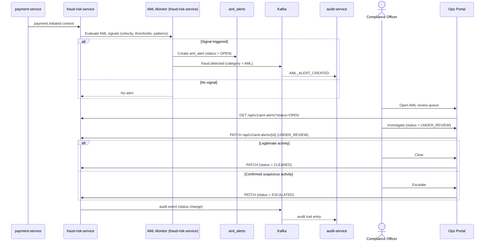

# AML Monitoring Flow

> **This is a simplified, educational AML implementation.** It demonstrates monitoring and case
> management patterns used in real AML programs but makes no claim of regulatory certification or
> production compliance. See [Governance Principles](../governance/governance-principles.md).

> **Implementation status (Phase 9):** the AML signal set (HIGH_VALUE, VELOCITY, STRUCTURING,
> REPEATED_NEW_BENEFICIARY), `aml_alerts` and its OPEN → UNDER_REVIEW → CLEARED/ESCALATED
> lifecycle, and the RBAC split (`RISK_ANALYST` can view but not transition; `COMPLIANCE_OFFICER`/
> `ADMIN` can) are all real — see
> [services/fraud-risk-service/README.md](../../services/fraud-risk-service/README.md). Signals
> are evaluated inline within the same synchronous `POST /risk-assessments` call from
> `payment-service` shown in fraud-flow.md, not via a separate `payment.initiated` Kafka
> consumption as an earlier sketch of this flow implied — `fraud-risk-service` itself still has no
> Kafka consumer. As of Phase 11, `AML_ALERT_CREATED` genuinely reaches the real, running
> `audit-service` via a real `audit.event` publish — see
> [services/audit-service/README.md](../../services/audit-service/README.md). AML alert
> resolution itself (unlike fraud alert resolution) remains single-actor, not maker-checker gated.

## Monitored Signals

- High-value transactions (above configurable threshold)
- Transaction velocity (count/volume over a rolling window)
- Suspicious patterns (e.g. structuring — multiple transfers just under a threshold)
- Repeated transfers to the same new beneficiary
- Unusual activity relative to customer's historical profile

## Case Statuses

```text
OPEN → UNDER_REVIEW → CLEARED
                     ↘ ESCALATED
```

## Sequence Diagram



## Roles

Only `COMPLIANCE_OFFICER` and `ADMIN` may transition an AML alert. `RISK_ANALYST` may view and flag
for compliance attention but not clear or escalate.
