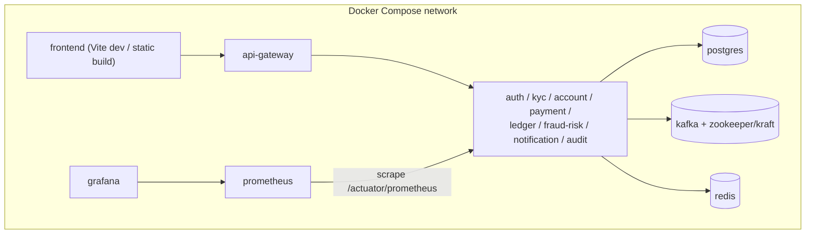
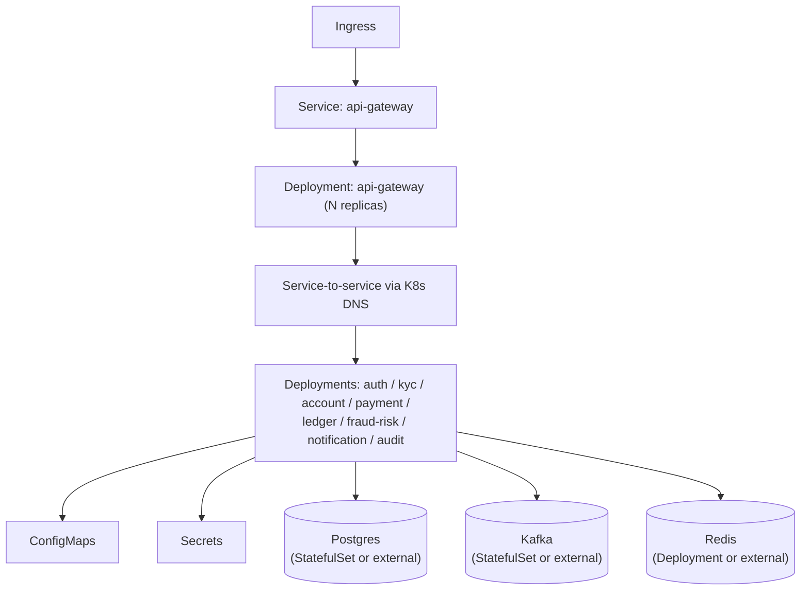

# Deployment Architecture

## Local Development (Docker Compose)

All infrastructure and services run locally via `docker-compose.yml` at the repository root — no
paid cloud services are required. Populated starting in Phase 1.

## Kubernetes (Minikube / Kind)

Each service ships a Deployment + Service + ConfigMap (+ Secret for credentials), with readiness and
liveness probes backed by Spring Boot Actuator, and resource requests/limits sized for local
clusters. Horizontal scaling is demonstrated on stateless services (`api-gateway`, `payment-service`
being the primary candidates given their request volume in the demo flows).

## Environments

This project targets a single **local/demo** environment. There is no staging or production
environment — Meridian Bank is a portfolio project and must never be connected to real banking
infrastructure (see [Safety & Realism Rules](../../README.md#safety--realism-rules)).

## Planned Implementation Phase

Phase 1 (Docker Compose infra), Phase 18 (Kubernetes manifests).
