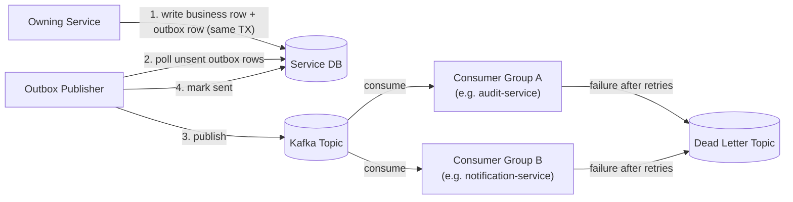

# Kafka Architecture

Full topic catalog and event contract conventions: [docs/kafka](../kafka).

> **Implementation status (Phase 13):** the **outbox pattern** and **producer-side retry + DLQ** are
> real and implemented exactly as described below, in `customer-kyc-service`, `account-service`,
> `payment-service`, `fraud-risk-service` (Phase 9), and `ledger-service` (Phase 12) — proven
> against a real Postgres and a real Kafka broker (Testcontainers), not simulated; see each
> service's README. **Idempotent consumers, consumer-side retry + DLQ, and consumer groups are
> real too**, in both services built to consume: `audit-service` (Phase 11, consuming
> `audit.event`) and `notification-service` (Phase 13, consuming `payment.completed`,
> `payment.failed`, `kyc.updated`, `account.approved`, `fraud.detected`, and
> `notification.requested`) — each under its own consumer group, de-duplicating by the envelope's
> `eventId`, retrying a failed message with exponential backoff, and dead-lettering an exhausted
> message to `<topic>.DLQ` via `DeadLetterPublishingRecoverer`. See
> [services/audit-service/README.md](../../services/audit-service/README.md) and
> [services/notification-service/README.md](../../services/notification-service/README.md).
> `fraud-risk-service` is still reached synchronously by `payment-service`
> (`POST /risk-assessments`), not via Kafka consumption — see
> [docs/kafka/topics.md](../kafka/topics.md)'s status note. `customer.created` and
> `account.created` still have no consumer.

## Design Principles

- **Outbox pattern.** A service never publishes to Kafka directly inside request handling. It writes
  its business record and a corresponding row in its own `outbox_events` table in the *same* database
  transaction; a separate outbox publisher relays that row to Kafka and marks it sent. If Kafka is
  temporarily unavailable, the event is retried from the outbox rather than lost. See
  [ADR-0005](../adr/0005-outbox-pattern.md).
- **Idempotent consumers.** Every consumer is written to tolerate at-least-once delivery — it
  de-duplicates by event ID/idempotency key before applying side effects, since Kafka delivery
  guarantees are at-least-once, not exactly-once, end to end.
- **Retry + DLQ.** Consumer failures are retried with backoff up to a bounded limit; events that
  still fail are routed to a dead-letter topic for investigation rather than blocking the consumer
  group or being silently dropped.
- **Event versioning.** Event payloads carry a schema version field; consumers are written to
  tolerate additive changes and reject/quarantine incompatible versions rather than crash.
- **Consumer groups** are scoped per owning service/purpose (e.g. `audit-service` and
  `notification-service` each run their own consumer group against the same topics) so one slow
  consumer never blocks another.

## Topic Catalog (see [docs/kafka](../kafka) for full detail)

```text
customer.created
kyc.updated
account.created
account.approved
payment.initiated
payment.completed
payment.failed
payment.reversed
fraud.detected
notification.requested
audit.event
reconciliation.completed
```

## Flow



## Planned Implementation Phase

Phase 8 (Kafka + Outbox + Retry + DLQ — producer side; see the implementation-status note above),
building on events introduced incrementally from Phase 3 onward by their owning services.
`fraud-risk-service` (Phase 9) turned out not to need consumer-side Kafka wiring at all — it's
reached synchronously (see the status note above). Phase 11 (`audit-service`) delivered the
consumer-side idempotency/retry/DLQ/consumer-group principles above for real, for the first time;
Phase 13 (`notification-service`) delivered the second, and is the last consumer this project
plans to add.
