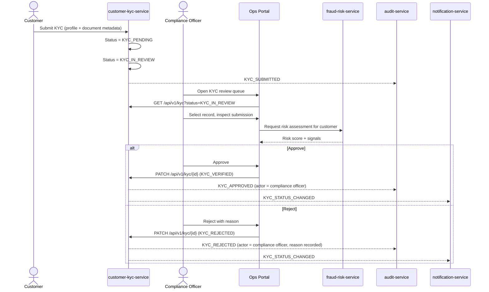

# KYC Review Flow

Detail of the KYC submission and compliance review stage referenced in
[onboarding-flow.md](onboarding-flow.md).

> **Implementation status (Phase 3):** submission, the `KYC_PENDING → KYC_IN_REVIEW → VERIFIED/
> REJECTED` state machine, and RBAC are implemented in `customer-kyc-service` — see
> [services/customer-kyc-service/README.md](../../services/customer-kyc-service/README.md). As of
> Phase 9, `fraud-risk-service` genuinely exposes
> `GET /api/v1/customers/{id}/risk-summary` for the `OPS->>FRAUD` step below — see
> [services/fraud-risk-service/README.md](../../services/fraud-risk-service/README.md). As of
> Phase 15, the Operations Portal's KYC Review screen (`/ops/kyc`) is real and calls
> `customer-kyc-service` directly for the review queue and decisions — but it still doesn't call
> `risk-summary`: `api-gateway` deliberately leaves that endpoint unrouted, since its path collides
> with the broader `/api/v1/customers` prefix already owned by customer-kyc-service (see
> [services/api-gateway/README.md](../../services/api-gateway/README.md)'s routing table), and
> nothing in Phase 15's actual route list called for a risk-summary panel on this screen. `audit-service`
> writes and `notification-service` dispatch shown below are real as of Phases 11 and 13
> respectively — but every KYC decision is still made directly by a `COMPLIANCE_OFFICER` with no
> automated risk input surfaced in the review UI.

## States

```text
KYC_PENDING → KYC_IN_REVIEW → KYC_VERIFIED
                            ↘ KYC_REJECTED
```

## Sequence Diagram



## Rules

- Only the `COMPLIANCE_OFFICER` role may transition a KYC record out of `KYC_IN_REVIEW`.
- Every transition is written to `audit_events` with actor, role, and correlation ID — see
  [Audit Service](../../services/audit-service/README.md).
- Rejected customers may resubmit; each submission creates a new KYC record so history is preserved
  (`kyc_records` is never overwritten in place).
- No real identity documents are ever stored — only synthetic document metadata.
