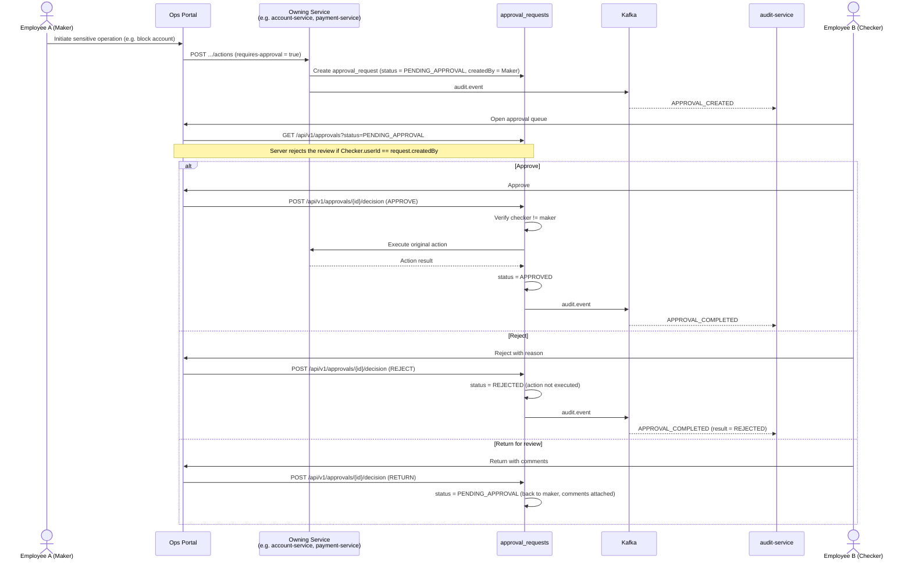

# Maker-Checker (Four-Eyes) Flow

> **Implementation status (Phase 10):** Real and independently implemented in each of the four
> gating services — [account-service](../../services/account-service) (account blocking),
> [customer-kyc-service](../../services/customer-kyc-service) (customer status changes),
> [fraud-risk-service](../../services/fraud-risk-service) (fraud alert resolution and fraud rule
> updates), and [payment-service](../../services/payment-service) (release of a REVIEW-held
> payment) — proven server-side (not just hidden in a UI) via live-HTTP integration tests: the
> checker can never be the maker (`403 SELF_APPROVAL_NOT_ALLOWED`), and a genuinely different
> staff member's approval actually executes the gated action. Each service duplicates its own
> `approval` package (`ApprovalRequest`/`ApprovalService`/`ApprovalController`, plus a
> service-specific `ApprovalActionType`) rather than sharing one, matching this project's
> no-shared-library convention (ADR-0003). Two scope reductions from the diagram below, documented
> here rather than left implicit: there is **no "Return for revision" cycle** — only APPROVE/REJECT
> — so a single `approval_requests` table per service is sufficient, with no separate
> `approval_actions` history table. As of Phase 11, the `audit.event` step below is real: all four
> gating services publish `APPROVAL_CREATED` (on request creation) and `APPROVAL_COMPLETED` (on
> approve or reject, carrying the decision in `result`) to the real, running `audit-service` — see
> [services/audit-service/README.md](../../services/audit-service/README.md). The `AUDIT` actor
> box below still doesn't map to a literal "Ops Portal → audit-service" HTTP call the way the
> diagram implies — ingestion is Kafka-only, even though the Ops Portal now exists (Phase 15) and
> has its own read-only Audit Trail screen (`/ops/audit`) querying `audit-service` directly — the
> underlying event genuinely reaches a durable, queryable audit trail, which is what matters for
> the invariant this doc exists to describe. As of Phase 15, the Ops Portal's Approvals screen
> (`/ops/approvals`) is also real, unifying all four services' otherwise-identical-looking
> `/api/v1/approvals` queues behind gateway-side path aliases (`api-gateway` rewrites
> `/api/v1/ops/approvals/<service>` to each service's real path — see
> [services/api-gateway/README.md](../../services/api-gateway/README.md)), since the four services'
> real endpoint is the literal same path and can't be told apart by a gateway otherwise.
> The `approval_requests` row itself
> (`decidedBy`/`decidedAt`/`decisionNotes`) remains each gating service's own additional record.
> "Account block/unblock" in the summary line below is, in practice, block only —
> there is no unblock action anywhere in the system. Not every sensitive operation the brief
> mentions is gated: e.g. beneficiary block/unblock and account freeze/close remain single-actor —
> see each service's README for exactly which of its endpoints are gated and which aren't.

Segregation of duties for sensitive operations: high-value transaction approval, account
block/unblock, customer status changes, configuration changes, and high-risk fraud decisions.

## State Flow

```text
Employee A (Maker)
        ↓
   Creates Request
        ↓
   PENDING_APPROVAL
        ↓
Employee B (Checker)
        ↓
     Reviews
        ↓
Approve → Action Executed
Reject  → Request Rejected (no action taken)
Return  → Back to Maker for revision
```

## Sequence Diagram



## Invariant

The maker can never approve their own request. This is enforced server-side in `approval_requests`
(comparing `createdBy` to the acting user), not just hidden in the UI — see
[Security Architecture](../security/security-architecture.md). Every approval decision, whatever the
outcome, is written to the audit trail.
