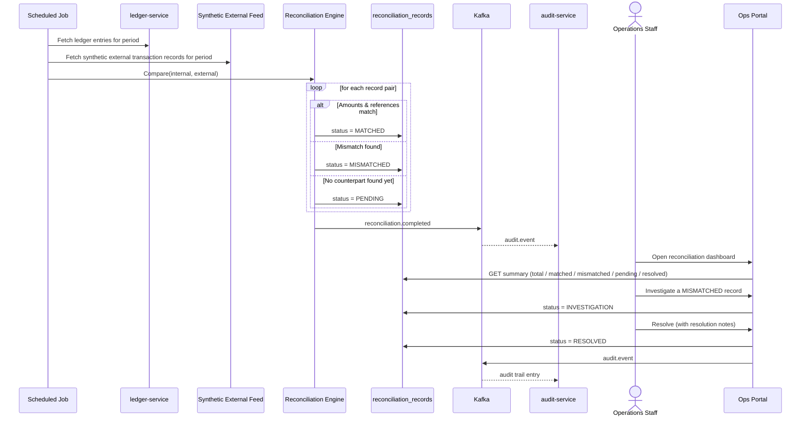

# Reconciliation Flow

> **Implementation status (Phase 12):** the compare/classify loop below is real — see
> [Reconciliation Design](../reconciliation/reconciliation-design.md)'s implementation-status note
> for exactly what's real and what (the Ops Portal) is still a future phase. One correction to the
> sequence diagram below: the external feed is not a live external system a scheduled job "fetches
> from" — it's synthesized on demand, lazily, the first time the job encounters a transaction with
> no counterpart yet (`ExternalFeedGenerator`), not pre-fetched for a period up front.

Full design rationale: [Reconciliation Design](../reconciliation/reconciliation-design.md).

## Flow

```text
Internal Ledger (ledger_entries)
            ↓
        Compare
            ↓
Synthetic External Records (reconciliation_records source)
            ↓
     MATCH / MISMATCH
```

Statuses: `MATCHED`, `MISMATCHED`, `PENDING`, `INVESTIGATION`, `RESOLVED`.

## Sequence Diagram



## Notes

- External records are always synthetic, generated locally for demo purposes — never real external
  bank data or a real third-party integration.
- Reconciliation never mutates `ledger_entries`; it only ever produces/updates
  `reconciliation_records`, keeping the ledger the single append-only source of truth.
