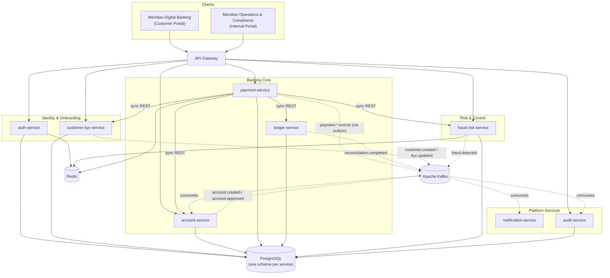

# System Architecture

## Overview

Meridian Bank is a set of independently deployable Spring Boot microservices behind a single API
gateway, backed by PostgreSQL (system of record), Kafka (asynchronous event backbone), and Redis
(idempotency, rate limiting, short-lived risk/OTP data). Two React/TypeScript single-page
applications — the customer portal (Meridian Digital Banking) and the internal portal (Meridian
Operations & Compliance) — consume the same gateway.

The service count is deliberately fixed at nine (see [ADR-0001](../adr/0001-microservices-architecture.md)).
No new service should be added purely to increase the number of moving parts — a new capability
first asks whether it belongs inside an existing service's bounded context.

## Component Diagram



## Communication Style

- **Synchronous REST** is used where the caller needs an immediate answer to proceed — e.g.
  `payment-service` calling `account-service` for balance/status, `fraud-risk-service` for a risk
  decision, and `ledger-service` to post entries within the same request lifecycle.
- **Asynchronous Kafka events** are used for anything that other services react to but don't block
  on — notifications, audit trail population, cross-service state propagation (e.g. KYC status
  reaching account eligibility), and reconciliation triggers. See [kafka-architecture.md](kafka-architecture.md).

## Service Responsibilities

| Service | Responsibility | Primary data owned |
|---|---|---|
| `api-gateway` | Routing, JWT validation, rate limiting, correlation IDs | none (stateless edge) |
| `auth-service` | Login, JWT/refresh tokens, MFA, password policy, lockout, RBAC roles | credentials, sessions, roles |
| `customer-kyc-service` | Registration, profile, KYC review | customers, KYC records, documents metadata |
| `account-service` | Account opening workflow, account state, beneficiaries, limits | accounts, account holders, beneficiaries |
| `payment-service` | Payment orchestration, idempotency, transaction limits enforcement | transactions, idempotency keys |
| `ledger-service` | Double-entry ledger, balance derivation, concurrency control | ledger entries, balances |
| `fraud-risk-service` | Fraud rules, risk scoring, AML monitoring | fraud rules, fraud alerts, AML alerts |
| `notification-service` | In-app/email/SMS (simulated) notifications | notifications |
| `audit-service` | Append-only audit trail | audit events |

Each service owns its own data and schema; there is no shared database. Cross-service reads happen
via synchronous API calls or via data replicated locally through consumed Kafka events — never via
direct cross-service database access.

## Domain Entities (summary)

Full entity list and relationships: [Database / Domain Model](../database/domain-model.md).

```text
customers, customer_documents, kyc_records
account_opening_requests, accounts, account_holders
beneficiaries
transactions, transaction_status_history
ledger_entries, balances
fraud_rules, fraud_alerts
aml_alerts
approval_requests, approval_actions
reconciliation_records
audit_events
notifications
support_requests
outbox_events
```

## Cross-Cutting Concerns

- **Security:** [Security Architecture](../security/security-architecture.md)
- **Governance & data classification:** [Governance Principles](../governance/governance-principles.md)
- **API conventions:** [API Governance](../api/api-governance.md)
- **Deployment topology:** [Deployment Architecture](deployment-architecture.md)
