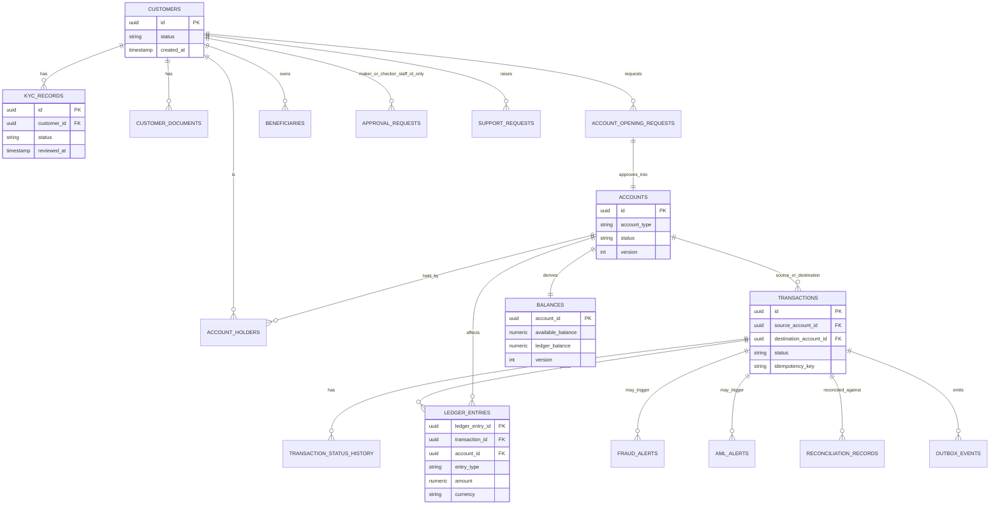

# Database / Domain Model

PostgreSQL is the system of record. **Each service owns its own schema** — there is no shared
database and no cross-service foreign keys; cross-service references are held as opaque IDs
resolved via API calls or locally-replicated data from consumed Kafka events. Migrations are managed
per-service with Flyway.

## Entity Overview by Owning Service

| Service | Tables |
|---|---|
| `customer-kyc-service` | `customers`, `customer_documents`, `kyc_records`, `outbox_events` |
| `account-service` | `account_opening_requests`, `accounts`, `account_status_history`, `beneficiaries`, `outbox_events` |
| `payment-service` | `transactions`, `transaction_status_history`, `outbox_events` |
| `ledger-service` | `ledger_entries`, `balances`, `outbox_events` (Phase 12), `external_transactions`, `reconciliation_records` |
| `fraud-risk-service` | `fraud_rules`, `risk_assessments`, `fraud_alerts`, `aml_alerts`, `outbox_events` |
| `account-service`, `customer-kyc-service`, `fraud-risk-service`, `payment-service` (one duplicated table per gating service — see [ADR-0011](../adr/0011-maker-checker.md), "Implementation notes") | `approval_requests` |
| `audit-service` | `audit_events` |
| `notification-service` | `notifications` |
| `customer-kyc-service` (finalized Phase 13 — see note below) | `support_requests` |

Every producing service's `outbox_events` table is a private implementation detail of the
transactional outbox pattern (Phase 8) — see [ADR-0005](../adr/0005-outbox-pattern.md) — not a
domain entity in its own right, so it's omitted from the conceptual ERD below.
`fraud-risk-service`'s `risk_assessments` is append-only and is that service's only source of
transaction history (see its README) — also not pictured below to keep the ERD focused on the
core banking entities.

**Implementation note (Phase 10):** ownership of `approval_requests` was finalized as one table
*duplicated per gating service* (`account-service`, `customer-kyc-service`, `fraud-risk-service`,
`payment-service`), each owned by that service's own `ApprovalService`, rather than a single
centralized table — see [ADR-0011](../adr/0011-maker-checker.md), "Implementation notes," for why.
There is no separate `approval_actions` table: only a single decision round (APPROVE/REJECT, no
"return for revision") is implemented, so each `approval_requests` row already is its own complete
decision record. `requested_by`/`decided_by` reference staff user ids from `auth-service`'s
`users` table (not pictured in this diagram, which focuses on core banking entities), not
`customers` — the `CUSTOMERS ||--o{ APPROVAL_REQUESTS` relationship below is a simplification of
that.

**Implementation note (Phase 13):** ownership of `support_requests` was finalized as
`customer-kyc-service` — a support request is fundamentally tied to the customer raising it, not
to any particular account or transaction, and this service already owns the `Customer` entity. Not
maker-checker gated (ticket resolution isn't in ADR-0011's governance-sensitive list); a single
decision round only (`OPEN` → `IN_PROGRESS` → `RESOLVED`, no reopen cycle), same scope reduction as
maker-checker's "no return for revision." Resolution is this project's first real producer to the
`notification.requested` topic — see
[services/customer-kyc-service/README.md](../../services/customer-kyc-service/README.md#customer-support-phase-13).

**Implementation note (Phase 4):** `accounts.customer_id` is a single owner — joint/multi-holder
accounts (a separate `account_holders` join table) aren't part of this brief's requirements and
weren't built to avoid speculative scope; single ownership is what Phase 4 actually needed. Revisit
if a later phase's requirements call for shared accounts.

## Conceptual ERD

## Common Column Conventions

- Primary keys: UUID.
- `created_at` / `updated_at` timestamps on every table.
- `version` column for optimistic locking on mutable financial state (`accounts`, `balances`),
  see [ADR-0008](../adr/0008-concurrency-strategy.md).
- Foreign keys within a service's own schema; unique constraints on natural keys (e.g.
  `transactions.idempotency_key` unique per customer).
- Check constraints on status enums and non-negative monetary amounts.
- Indexes on frequently filtered columns (status, customer/account ID, created_at) to support the
  paginated list/search UIs in the operations portal.

## Planned Implementation Phase

Schemas and Flyway migrations are introduced per-service, starting with `customer-kyc-service` and
`account-service` in Phase 3–4, `payment-service`/`ledger-service` in Phase 6–7, and so on per the
phase plan in [CLAUDE.md](../../CLAUDE.md).
